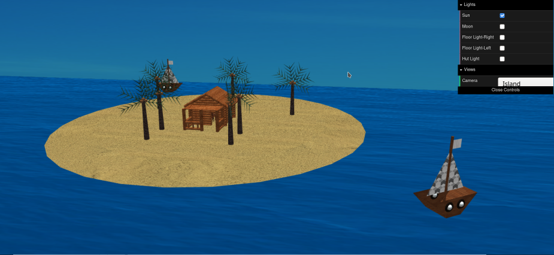

# LAIG 2020/2021

## Group T05G03
| Name             | Number    | E-Mail                |
| ---------------- | --------- | --------------------- |
| Ana Teresa       | 201606703 | up201606703@fe.up.pt  |
| Ricardo Cardoso  | 201604686 | up201604686@fe.up.pt  |

----

## Projects

### [TP1 - Scene Graph](TP1)

- For TP1 we created two scenes:
    - In the main one we can se an island scene.
    - In the second one we can see every primitive and how their textures work.

  
  

-----

### [TP2 - ...](TP2)
- (items briefly describing main strong points)

----

### [TP3 - ...](TP3)
- (items briefly describing main strong points)
