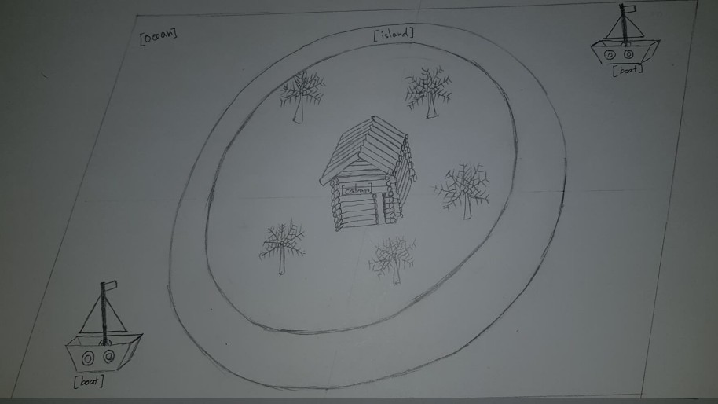

# LAIG 2020/2021 - TP1

## Group: T05G03

| Name             | Number    | E-Mail                |
| ---------------- | --------- | --------------------- |
| Ana Teresa       | 201606703 | up201606703@fe.up.pt  |
| Ricardo Cardoso  | 201604686 | up201604686@fe.up.pt  |

----
## Project information

- XML file (island scene) already full of information.
- Scene
  - Our scene represents an island composed by a big ocean, a circular sand island, a wood caban, some trees and a couple boats.
  - Island scene: [island.xml](TP1/scenes/LAIG_TP1_XML_T5_G03_v03.xml).

----
## Issues/Problems

- We don't have the [parser](MySceneGraph.js) complete yet, so we can't see the scene we created, there might be some bugs.
